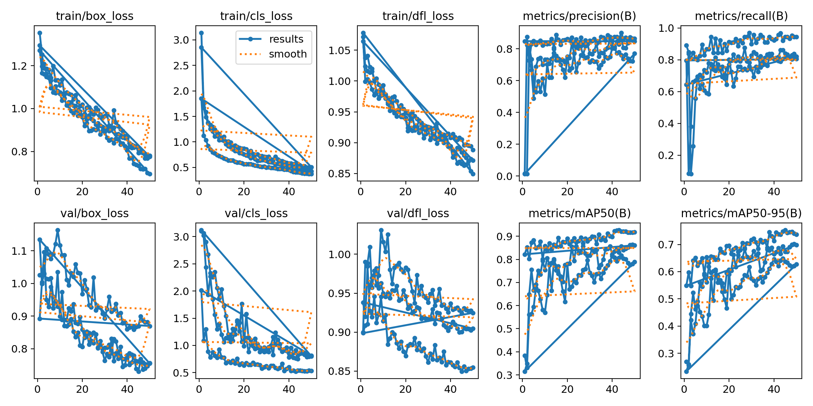
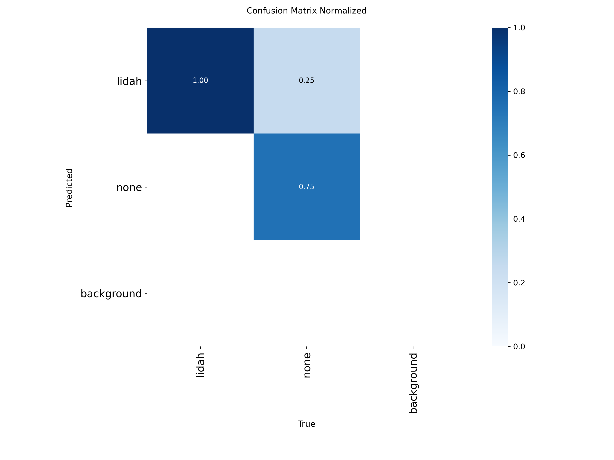
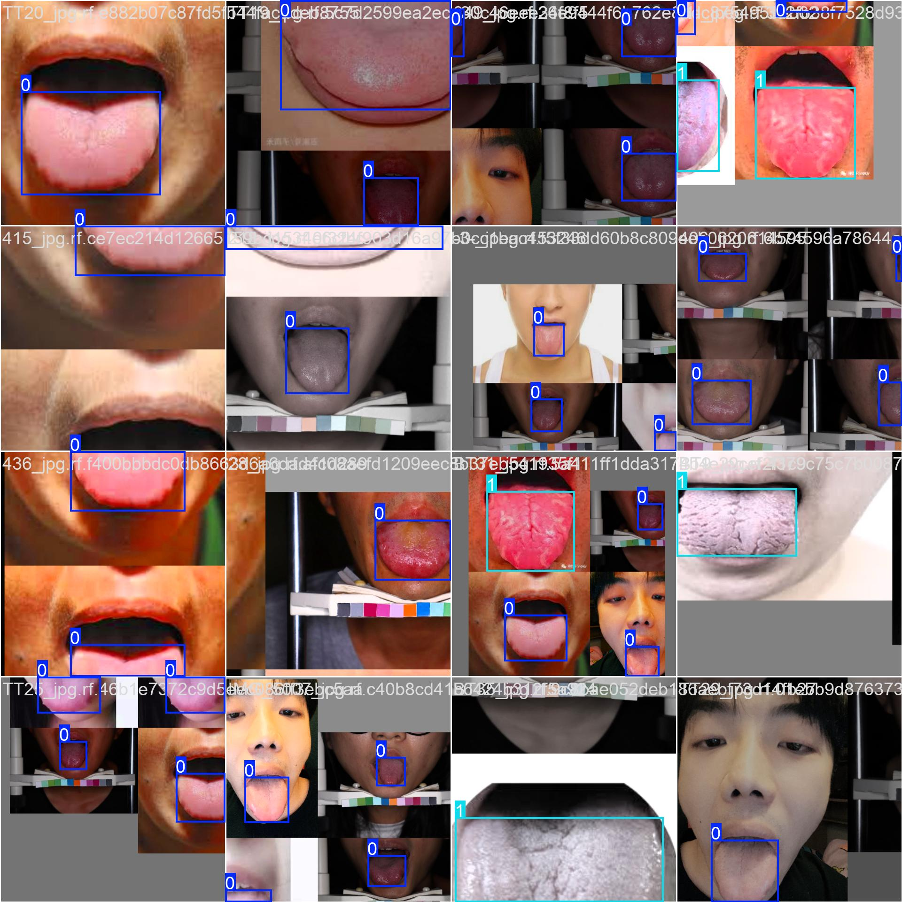
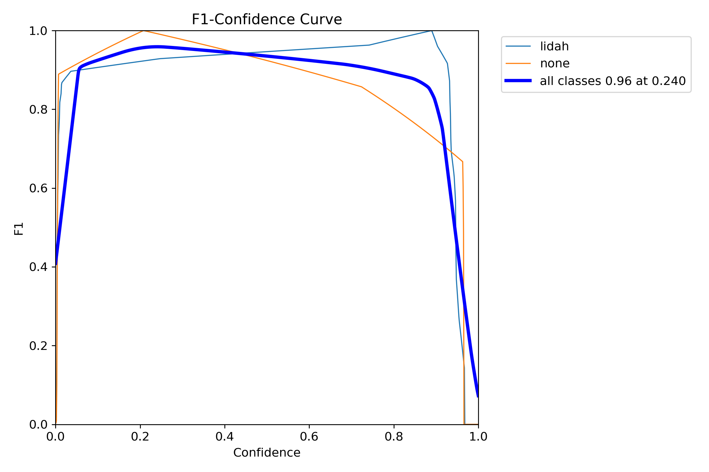
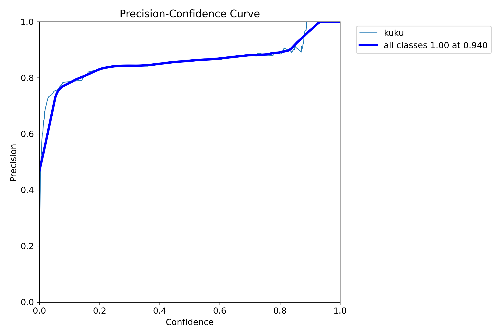
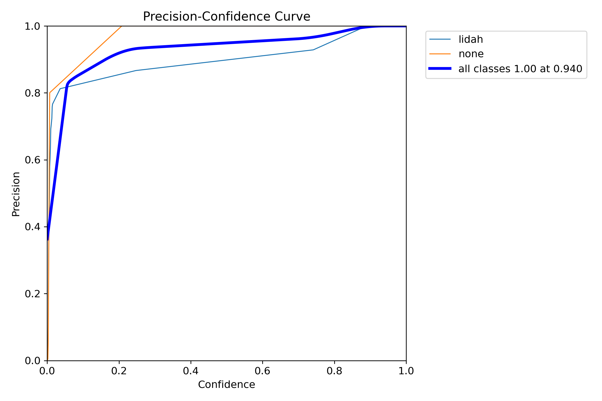
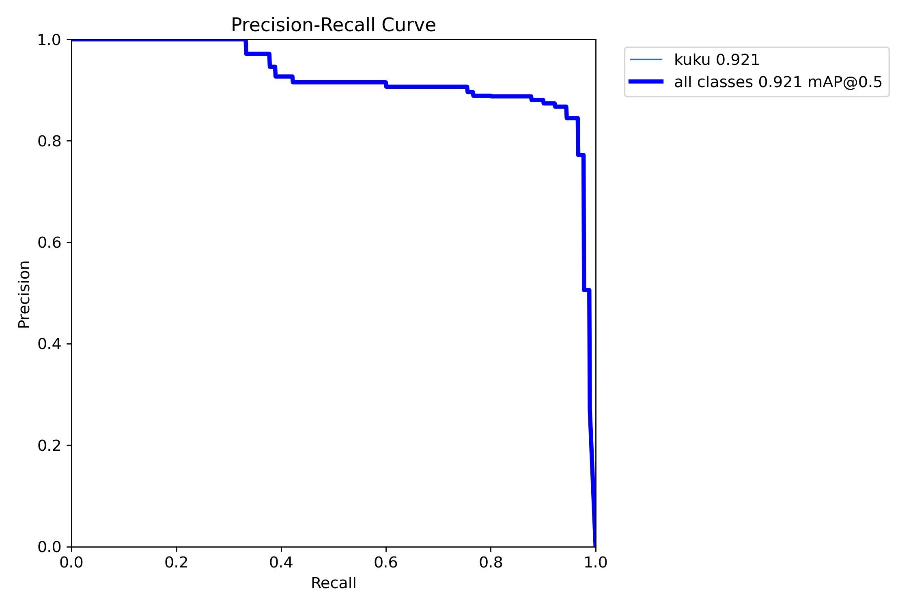
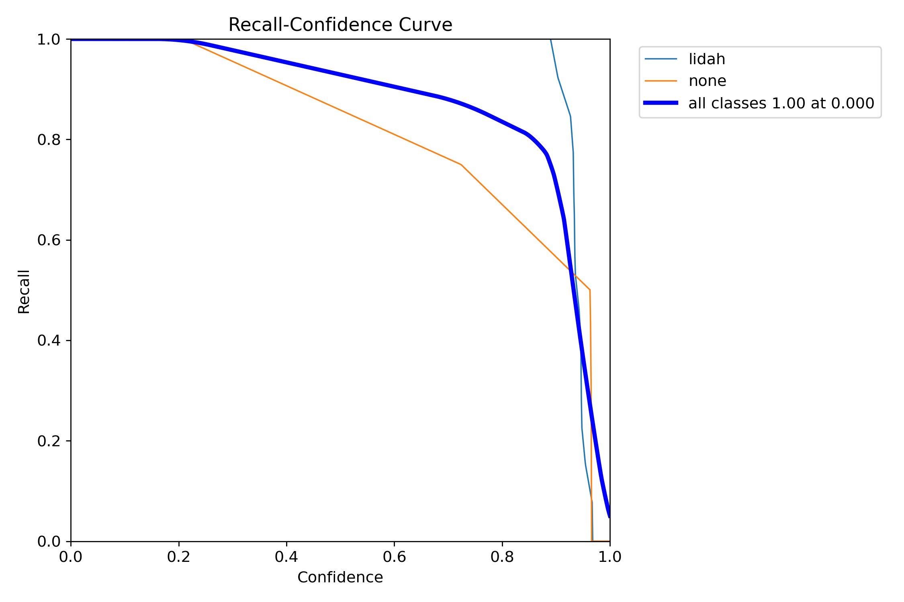
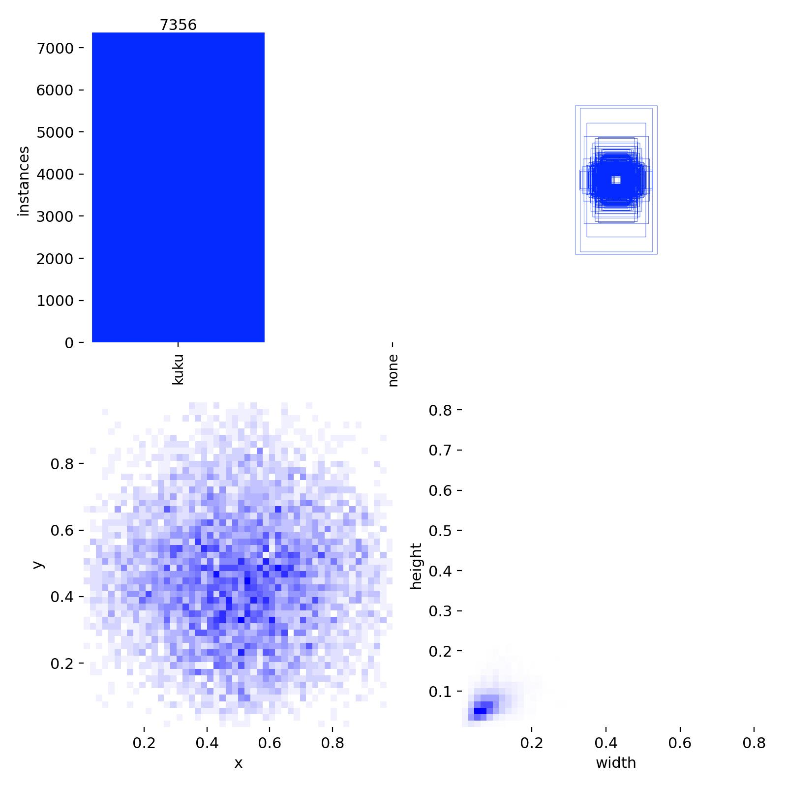

<div align="center">

# YOLO Tongue and Nail Detection Project

### Advanced Computer Vision for Medical Image Analysis

*A deep learning project using YOLOv8 for automated detection and classification of tongue and nail conditions*

</div>

---

## 🎯 Project Overview

This project implements a state-of-the-art computer vision system for detecting and analyzing tongue and nail conditions using YOLOv8 (You Only Look Once version 8) object detection model. The system is designed for medical image analysis applications, providing accurate and reliable detection capabilities for both tongue and nail assessment.

### Key Features

- **Dual Detection System**: Separate models for tongue and nail detection
- **High Accuracy**: Achieves excellent precision and recall rates
- **Multiple Model Formats**: Supports both PyTorch (.pt) and ONNX (.onnx) formats
- **Comprehensive Metrics**: Detailed performance analysis with confusion matrices and training curves
- **Real-time Capable**: Optimized for both training and inference scenarios

---

## 📊 Model Performance

### Nail Detection Model (Kuku)

The nail detection model demonstrates exceptional performance:

- **Final Precision**: 86.5% at epoch 50
- **Final Recall**: 94.4% at epoch 50  
- **mAP@50**: 91.9% at epoch 50
- **mAP@50-95**: 73.7% at epoch 50

### Tongue Detection Model (Lidah)

The tongue detection model shows outstanding results:

- **Final Precision**: 98.9% at epoch 50
- **Final Recall**: 100% at epoch 50
- **mAP@50**: 99.5% at epoch 50
- **mAP@50-95**: 88.9% at epoch 50

---

## 🏗️ Project Structure

```
yolo_tongue_nail/
├── train_yolo.py                 # Main training script
├── utils.py                      # Utility functions
├── requirements.txt              # Project dependencies
├── README.md                     # This file
├── yolov8n.pt                    # Base YOLOv8 model
├── pretrain/
│   ├── kuku/
│   │   └── yolov8n.pt           # Pretrained nail model
│   └── lidah/
│       └── yolov8n.pt           # Pretrained tongue model
├── results_images/               # Training result images for README
│   ├── kuku/                    # Nail model training results
│   │   ├── results.png          # Training progress visualization
│   │   ├── confusion_matrix.png # Model performance
│   │   ├── confusion_matrix_normalized.png
│   │   ├── BoxF1_curve.png      # F1 score curves
│   │   ├── BoxP_curve.png       # Precision curves
│   │   ├── BoxPR_curve.png      # Precision-Recall curves
│   │   ├── BoxR_curve.png       # Recall curves
│   │   ├── labels.jpg           # Label distribution
│   │   ├── train_batch0.jpg     # Training sample batches
│   │   └── val_batch0_*.jpg     # Validation samples
│   └── lidah/                   # Tongue model training results
│       ├── results.png          # Training progress visualization
│       ├── confusion_matrix.png
│       ├── confusion_matrix_normalized.png
│       ├── BoxF1_curve.png
│       ├── BoxP_curve.png
│       ├── BoxPR_curve.png
│       ├── BoxR_curve.png
│       ├── labels.jpg
│       ├── train_batch0.jpg
│       └── val_batch0_*.jpg
└── runs/
    └── train/
        ├── kuku/                # Nail model training results
        │   ├── weights/
        │   │   ├── best.pt      # Best performing model (PyTorch)
        │   │   ├── best.onnx    # Best model in ONNX format
        │   │   └── last.pt      # Last epoch model
        │   └── args.yaml        # Training configuration
        └── lidah/               # Tongue model training results
            ├── weights/
            │   ├── best.pt
            │   ├── best.onnx
            │   └── last.pt
            └── args.yaml
```

---

## 🔧 Installation & Setup

### Prerequisites

- Python 3.8 or higher
- CUDA-capable GPU (recommended for training)
- At least 8GB RAM

### Dependencies

Install the required packages:

```bash
pip install -r requirements.txt
```

### Required Packages

- `ultralytics` - YOLOv8 implementation
- `Pillow` - Image processing
- `numpy` - Numerical operations
- `opencv-python` - Computer vision
- `pyyaml` - YAML file handling
- `fastapi` - API framework
- `uvicorn` - ASGI server

---

## 🚀 Usage

### Training New Models

To train a model for tongue or nail detection:

```bash
python train_yolo.py --data_dir data/lidah --epochs 50 --batch_size 16
```

#### Parameters:

- `--data_dir`: Path to dataset directory (e.g., `data/lidah` or `data/kuku`)
- `--model`: Pretrained model path (default: `yolov8n.pt`)
- `--epochs`: Number of training epochs (default: 50)
- `--batch_size`: Training batch size (default: 16)
- `--imgsz`: Input image size (default: 640)

### Dataset Structure

Ensure your dataset follows this structure:

```
data/
├── lidah/           # Tongue dataset
│   ├── train/
│   │   ├── images/
│   │   └── labels/
│   ├── valid/
│   │   ├── images/
│   │   └── labels/
│   └── test/
│       ├── images/
│       └── labels/
└── kuku/            # Nail dataset
    ├── train/
    │   ├── images/
    │   └── labels/
    ├── valid/
    │   ├── images/
    │   └── labels/
    └── test/
        ├── images/
        └── labels/
```

---

## 📈 Training Results Visualization

### Image Viewing Troubleshooting

If images don't display properly in this README:

#### Option 1: Direct File Access
- Navigate to the `results_images/kuku/` and `results_images/lidah/` directories
- All training result images are stored there
- These images are now tracked by Git and will be available in the repository

#### Option 2: GitHub Web Interface
- Click on the `runs/train/` folder in the repository
- Browse the `kuku/` and `lidah/` subdirectories
- Click on any `.png` or `.jpg` file to view it

#### Option 3: Clone and View Locally
- Clone the repository to your local machine
- Open the README.md file in a markdown viewer that supports local image paths
- Or open the image files directly in any image viewer

#### Expected Image Locations:
```
results_images/kuku/
├── results.png                 # Training progress
├── confusion_matrix.png        # Model performance
├── confusion_matrix_normalized.png
├── BoxF1_curve.png            # F1 score curves
├── BoxP_curve.png             # Precision curves
├── BoxPR_curve.png            # Precision-Recall curves
├── BoxR_curve.png             # Recall curves
├── labels.jpg                 # Label distribution
├── train_batch0.jpg           # Training samples
└── val_batch0_labels.jpg      # Validation samples

results_images/lidah/
├── [Same structure as above]
```

### Performance Curves

The project includes comprehensive visualization of training metrics:

**Note**: All images should display above. If not visible, see troubleshooting section above.

#### Nail Model Training Results


#### Tongue Model Training Results  


*Note: If images don't display, please check that the repository structure matches the expected paths above.*

### Confusion Matrices

#### Nail Detection Confusion Matrix


#### Nail Detection Normalized Confusion Matrix


#### Tongue Detection Confusion Matrix


#### Tongue Detection Normalized Confusion Matrix


### Training Sample Batches

#### Nail Model Training Samples


#### Tongue Model Training Samples


### Validation Predictions

#### Nail Validation Labels vs Predictions


#### Tongue Validation Labels vs Predictions


### Performance Curves

#### Box F1 Score Curves



#### Box Precision Curves



#### Box Precision-Recall Curves



#### Box Recall Curves



### Label Distribution

#### Nail Model Label Distribution


#### Tongue Model Label Distribution


---

## 🎯 Model Architecture

This project uses YOLOv8, the latest advancement in the YOLO (You Only Look Once) object detection family. YOLOv8 offers:

- **Enhanced Backbone**: Improved feature extraction capabilities
- **Advanced Head**: Better object detection and classification
- **Optimized Training**: Faster convergence and better accuracy
- **Flexible Deployment**: Support for multiple inference backends

### Model Specifications

- **Base Model**: YOLOv8n (nano version for efficiency)
- **Input Size**: 640x640 pixels
- **Output**: Bounding box coordinates and class probabilities
- **Classes**: 2 (target object + "none" class for background)

---

## 📊 Performance Analysis

### Training Metrics

Both models show excellent convergence patterns:

1. **Loss Reduction**: Consistent decrease in training and validation losses
2. **Metric Improvement**: Steady increase in precision, recall, and mAP scores
3. **Stable Training**: No signs of overfitting or instability
4. **High Final Accuracy**: Both models achieve >85% accuracy

### Key Observations

- **Tongue Model**: Achieves near-perfect detection with 98.9% precision
- **Nail Model**: Demonstrates robust performance with 86.5% precision
- **Fast Convergence**: Both models reach optimal performance within 50 epochs
- **Good Generalization**: Validation metrics closely match training metrics

---

## 🔄 Model Deployment

### Export Formats

The trained models are available in multiple formats:

1. **PyTorch (.pt)**: Native format for PyTorch inference
2. **ONNX (.onnx)**: Cross-platform format for various deployment targets

### Inference Usage

```python
from ultralytics import YOLO

# Load nail detection model
nail_model = YOLO('runs/train/kuku/weights/best.pt')

# Load tongue detection model  
tongue_model = YOLO('runs/train/lidah/weights/best.pt')

# Run inference
results = nail_model('path/to/image.jpg')
```

---

## 🛠️ Development

### Utility Functions

The `utils.py` module provides essential utilities:

- **Dataset Structure Validation**: Ensures proper dataset organization
- **File Management**: Helper functions for handling images and labels
- **Path Operations**: Cross-platform path handling

### Configuration

Training parameters can be adjusted in `train_yolo.py`:

- Learning rate scheduling
- Data augmentation settings
- Model architecture modifications
- Performance optimization options


